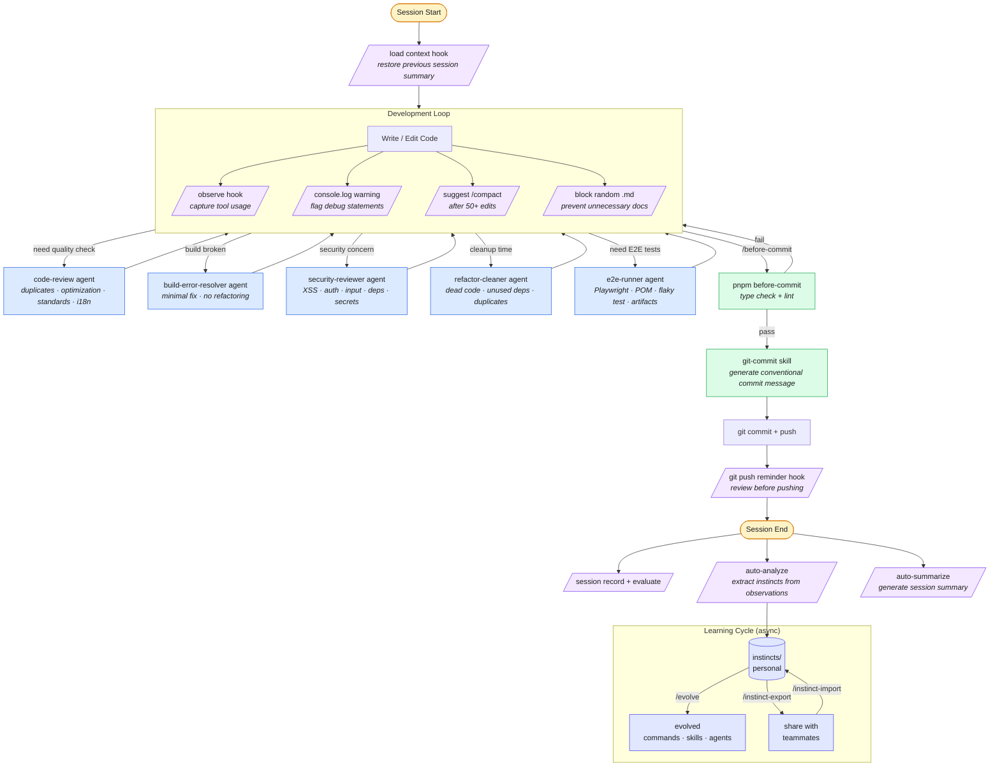

# my-everything-claude-code

Personal Claude Code plugin — shared hooks, skills, commands, and agents for all projects.

## Install

```bash
# Add marketplace
/plugin marketplace add ClayLeee/my-everything-claude-code

# Install plugin
/plugin install my-everything-claude-code@ClayLeee-my-everything-claude-code
```

## Structure

```
├── .claude-plugin/
│   ├── marketplace.json
│   └── plugin.json
├── commands/
│   ├── cl/                        # Continuous Learning (status, analyze, log, sync)
│   ├── e2e/                       # E2E Testing workflow (analyze, plan, create, run, maintain, remote)
│   ├── evolve.md                  # Cluster instincts into skills/commands/agents
│   ├── instinct-export.md         # Export instincts for sharing
│   ├── instinct-import.md         # Import instincts from others
│   ├── before-commit.md            # Run checks then generate commit message
│   ├── learn-eval.md              # Extract patterns with quality evaluation
│   └── skill-create.md            # Generate SKILL.md from git history
├── skills/
│   ├── continuous-learning-v2/    # Instinct-based learning system
│   ├── e2e-testing/               # Playwright E2E testing patterns and POM examples
│   └── serena-tool-selection/     # Serena LSP vs basic tools decision framework
├── agents/
│   ├── build-error-resolver.md    # Fix build/type errors with minimal changes
│   ├── code-review.md             # Code review agent
│   ├── e2e-runner.md              # Playwright E2E testing specialist
│   ├── refactor-cleaner.md        # Dead code cleanup and duplicate consolidation
│   └── security-reviewer.md       # Frontend security vulnerability detection
├── rules/
│   ├── coding-style.md            # Immutability, size limits, Vue/TS conventions
│   ├── performance.md             # Model selection, context window management
│   └── security.md                # XSS prevention, input validation, secrets
├── hooks/
│   └── hooks.json                 # All hook definitions
└── scripts/
    ├── hooks/                     # Hook scripts
    └── lib/                       # Shared utilities
```

## Development Workflow



> **Legend:** <span style="color:#7c3aed">Purple</span> = auto hooks · <span style="color:#2563eb">Blue</span> = on-demand agents · <span style="color:#16a34a">Green</span> = commands · <span style="color:#d97706">Yellow</span> = session lifecycle

## What's Included

### Hooks

| Event | Hook | Description |
|-------|------|-------------|
| PreToolUse | git push reminder | Warn before pushing |
| PreToolUse | block random .md | Prevent unnecessary doc files |
| PreToolUse | suggest compact | Remind `/compact` after 50 edits |
| PreToolUse | observe (pre) | Collect tool usage observations |
| PostToolUse | console.log warning | Flag `console.log` in edited code |
| PostToolUse | observe (post) | Collect tool results |
| PreCompact | compaction log | Record compaction events |
| PreCompact | auto-analyze | Extract instincts from observations |
| SessionStart | load context | Load previous session summary |
| Stop | global console.log check | Scan all git-changed files |
| SessionEnd | session record | Save session metadata |
| SessionEnd | evaluate session | Log session length |
| SessionEnd | auto-analyze | Extract instincts from observations |
| SessionEnd | auto-summarize | Generate session summary |

### Rules

Global rules installed to `~/.claude/rules/` for automatic enforcement:

- **coding-style** — Immutability, file/function size limits, Vue/TS conventions
- **performance** — Model selection strategy, context window management
- **security** — XSS prevention, input validation, secret management for frontend

### Skills

- **continuous-learning-v2** — Instinct-based learning from session observations
- **e2e-testing** — Playwright E2E testing patterns, POM examples, config templates, flaky test strategies, multi-role test credentials
- **serena-tool-selection** — Decision framework for choosing between Serena LSP semantic tools and basic tools (Grep, Read, Glob, Edit)

### Agents

- **code-review** — Code quality review (duplicates, optimization, standards, comments, i18n)
- **build-error-resolver** — Fix build/type errors with minimal changes, no refactoring
- **security-reviewer** — Frontend security audit (XSS, auth, input validation, dependencies, secrets)
- **refactor-cleaner** — Dead code detection, unused dependency removal, duplicate consolidation
- **e2e-runner** — Playwright E2E testing auto-dispatcher: detects mode (Create/Maintain/Run/Remote), runs full pipeline, generates dual reports

### Commands

- `/before-commit` — Run project checks (`pnpm before-commit`), then generate conventional commit message
- `/e2e:analyze` — Analyze page structure and build Semantic Element Table
- `/e2e:plan` — Generate coverage plan from analysis artifact
- `/e2e:create` — Create POM + spec, run tests, generate dual reports (HTML + MD)
- `/e2e:maintain` — Incrementally update tests from code changes, run tests, generate reports
- `/e2e:run` — Run existing tests with error classification and dual reports
- `/e2e:remote` — Scaffold Playwright project, explore remote URL via MCP, create and run tests
- `/cl:status` — Show learned instincts with confidence scores
- `/cl:analyze` — Manually trigger observation analysis
- `/cl:log` — Show recent observer log entries
- `/cl:sync` — Update instincts.md from current instincts
- `/evolve` — Cluster related instincts into commands/skills/agents
- `/instinct-export` — Export instincts to shareable YAML format
- `/instinct-import` — Import instincts with conflict detection
- `/learn-eval` — Extract session patterns with quality self-evaluation
- `/skill-create` — Analyze git history to generate SKILL.md files

## Credits

Hooks system adapted from [affaan-m/everything-claude-code](https://github.com/affaan-m/everything-claude-code) (MIT License).
